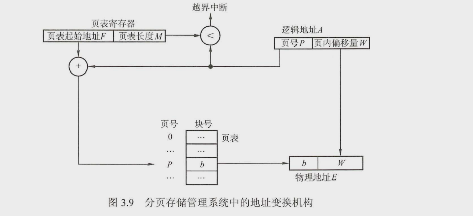

<!-- TOC -->

- [内存管理](#内存管理)
    - [覆盖与交换->扩充内存](#覆盖与交换-扩充内存)
    - [连续分配->内存分配](#连续分配-内存分配)
    - [非连续分配](#非连续分配)

<!-- /TOC -->
# 内存管理
   - 内存管理的功能:
      - 内存空间的分配与回收 内存空间的分配.
      - 地址转换 逻辑地址->物理地址
      - 内存空间扩展 利用虚拟技术或自动覆盖技术,扩展内存
      - 存储保护 各道作业相互运行,互不干扰.
## 覆盖与交换->扩充内存
  - 覆盖: 将部分需要进行全局流程控制的代码放到固定区,不允许覆盖.对于其它模块:运行时候,放入覆盖区域,运行完毕后,移除,移入下一个执行模块.
  - 交换: 将等待的进程移出内存(换出),把以及就绪的进程移入内存进行执行(换入).

## 连续分配->内存分配
  - 单一连续分配
      - 内部分为系统区和用户区.系统区->供系统调用(低地址).用户区供应用使用.不需要保护
  - 固定分区分配:
      - 内存划分为固定大小的区域,每个分区仅装入一个作业
      - 分区大小相等/不等
      - (内部碎片):固定内存放入的程序较小,导致部分内存无法使用.
  - 动态分区分配:
    - 根据进程载入的时候,动态的创建分区.
    - 外部碎片:由于动态分区,分区外部的存储产生大量小空间碎片.
    - 分配算法:
      - 首次匹配:分区按照序号进行排序,找到第一个空间服务的分区
      - 最坏匹配:分区按照容量进行排序,找到空间最大的分区
      - 最佳匹配:分区按照容量进行排序,找到第一个满足要求的分区
      - 临近匹配:与首次匹配类似,不过在上次附近进行查找

## 非连续分配
  - 允许一个程序将程序分散的装入不连续的内存中.
  - ### 根据分区大小是否固定分类
    - 分页存储管理方式
      - 基本概念:
        - 进程中的块:页.内存中的块:页框/帧.
        - 逻辑结构(决定寻址空间):由页号和页內偏移量组成.每页大小为4KB
        - 页表:每个进程用于记录使用的页面,以及对应的物理块号
            - 实现从页号到物理块号的映射.
            - 页表项:页号,物理块号.
            - 物理块号+页內偏移量 = 实际物理地址.
        - 逻辑结构:记录内存中的块以及对应的物理地址.
        - 基本地址变化:将逻辑地址转换为物理地址.
          - 一般计算步骤:对于表长度M,起始地址F,页面大小L,逻辑地址A到物理地址E的过程(十进制)
          ```
          页号P=A/L;页內偏移量W=A%L;
          比较P与M,如果P>=M,则越界终端,否则,继续执行.
          从页表中去取得页号P对应的页表项地址=F+(P对应的物理快号)*L
          ```

  - 使用快表(相联存储器TLB):加速查询.将部分查询频繁的页表项放入快表中.没有命中,在从头开始查找.
      - 另外有二级分页,将页进行再度划分
      - 基本分页存储管理方式:开始时候装入全部内存
      - 请求分页存储管理方式:开始时候装入部分,而后根据需要装入.
    - 分段式存储管理:
      - 考虑: