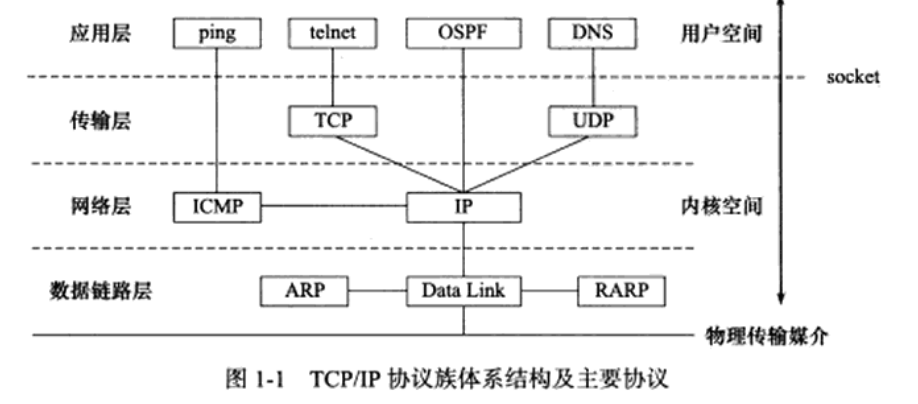

# 计算机网络
<!-- TOC -->

- [计算机网络](#计算机网络)
    - [七层网络协议](#七层网络协议)
    - [请简述TCP\UDP的区别](#请简述tcp\udp的区别)
    - [TCP](#tcp)
    - [常用端口(应用层)](#常用端口应用层)
    - [TCP三次握手](#tcp三次握手)
    - [请求码](#请求码)
    - [HTTP与HTTPS区别](#http与https区别)
    - [session和cookies](#session和cookies)
    - [HTTP请求报文构成](#http请求报文构成)
    - [层次协议](#层次协议)
    - [常见面试问题](#常见面试问题)

<!-- /TOC -->
## 七层网络协议
    1. 物理层
    2. 数据链路层
    3. 网络层 ARP IP
    4. 传输层  TCP UDP
    {表示层，会话层}
    5. 应用层 DNS HTTP SMTP POP3 Telnet
---
## 请简述TCP\UDP的区别
   - TCP和UDP是OSI模型中的运输层中的协议。TCP提供可靠的通信传输，而UDP则常被用于让广播和细节控制交给应用的通信传输。
   - TCP面向连接，UDP面向非连接即发送数据前不需要建立链接
   - TCP提供可靠的服务（数据传输），UDP无法保证
   - TCP面向字节流，UDP面向报文
   - TCP数据传输慢，UDP数据传输快
---
## TCP
   - [流量控制](https://www.jianshu.com/p/c7d699eb4825):TCP利用滑动窗口机制在TCP连接上实现对发送方的流量控制， 如果发送方把数据发送得过快，接收方可能会来不及接收，这就会造成数据的丢失。所谓流量控制就是让发送方的发送速率不要太快，要让接收方来得及接收
   - [拥塞控制]():防止过多的数据注入到网络中，这样可以使网络中的路由器或链路不致过载。拥塞控制所要做的都有一个前提：网络能够承受现有的网络负荷。拥塞控制是一个全局性的过程，涉及到所有的主机、路由器，以及与降低网络传输性能有关的所有因素
      - 慢开始:发送方维持一个拥塞窗口,大小动态变化.经过一个传输轮次,拥塞窗口cwnd就加倍.
      - 拥塞避免:拥塞窗口缓慢增长，即每经过一个往返时间RTT就把发送方的拥塞窗口cwnd加1，而不是加倍。这样拥塞窗口按线性规律缓慢增长.
      - 当判断发送方判断网络拥塞,把慢开始门限ssthresh缩小为cwnd的一半,然后设定cwnd的大小为1.
      - 快重传:发送方只要一连收到三个重复确认就应当立即重传对方尚未收到的报文段
      - 快回复:快重传过成中,发送方ssthresh的门限为cwnd减半,此时先执行拥塞避免算法,缓慢增大cwnd.
   - 数据重传:TCP传输数据可靠的保证
      - 触发重传:1.数据报文丢失 2.接受段的确认报文丢失 3.接收端异常未响应ACK或被接收端丢弃
      - 重传策略:
         - 1，超时重传机制 2，快速重传机制 3，SACK 方法 4，Duplicate SACK – 重复收到数据的问题
---
## 常用端口(应用层)
   - 21 FTP文件传输(tcp)
   - 22 SSH(tcp)
   - 23 Telnet远程连接服务
   - 25 SMTP简单邮件系统
   - 53 DNS域名解析系统
   - 80 HTTP超文本传输协议
   - 110 pop3邮件协议
   - 443 HTTPS
   - 1080  sockets
   - 3306 mysql默认端口
---
## TCP三次握手
答:建立连接的过程是利用客户服务器模式，假设主机A为客户端，主机B为服务器端。  
   1. TCP的三次握手过程：主机A向B发送连接请求；主机B对收到的主机A的报文段进行确认；主机A再次对主机B的确认进行确认。  
   2. 采用三次握手是为了防止失效的连接请求报文段突然又传送到主机B，因而产生错误。失效的连接请求报文段是指：主机A发出的连接请求没有收到主机B的确认，于是经过一段时间后，主机A又重新向主机B发送连接请求，且建立成功，顺序完成数据传输。考虑这样一种特殊情况，主机A第一次发送的连接请求并没有丢失，而是因为网络节点导致延迟达到主机B，主机B以为是主机A又发起的新连接，于是主机B同意连接，并向主机A发回确认，但是此时主机A根本不会理会，主机B就一直在等待主机A发送数据，导致主机B的资源浪费。  
   3. 采用两次握手不行，原因就是上面说的实效的连接请求的特殊情况。
  

---
5. 在浏览器中输入网址之后执行会发生什么？
   1. 查找域名对应的IP地址。这一步会依次查找浏览器缓存，系统缓存，路由器缓存，ISPNDS缓存，根域名服务器
   2. 建立tcp链接.
   3. 浏览器向IP对应的web服务器发送一个HTTP请求
   4. 服务器响应请求，发回网页内容
   5. 浏览器解析网页内容  

---
6. http请求:包含的请求
   - GET：对服务器资源的简单请求
   - POST：用于发送包含用户提交数据的请求
   - HEAD：类似于GET请求，不过返回的响应中没有具体内容，用于获取报头
   - PUT：传说中请求文档的一个版本
   - DELETE：发出一个删除指定文档的请求
   - TRACE：发送一个请求副本，以跟踪其处理进程
   - OPTIONS：返回所有可用的方法，检查服务器支持哪些方法
   - CONNECT：用于ssl隧道的基于代理的请求
   - get与post的差别： 
      - 根据HTTP规范，GET用于信息获取，而且应该是安全和幂等的
      - 根据HTTP规范，POST请求表示可能修改服务器上资源的请求
      - GET请求的数据会附在URL后面，POST的数据放在HTTP包体
      - POST安全性比GET安全性高
---
7. [http缓存](https://zhuanlan.zhihu.com/p/342774826):缓存部分数据
   - 强缓存: 强缓存是利用http头中的Expires和Cache-Control两个字段来控制的。强缓存中，当请求再次发出时，浏览器会根据其中的Expires和Cache-Control判断目标资源是否“命中”强缓存，如果命中则直接从缓存中获取资源，不会再与服务端发生通信.
   - 对比缓存:协商缓存机制下，浏览器需要向服务器去询问缓存的相关信息，进而判断是重新发起请求、下载完整的响应，还是从本地获取缓存的资源.
7. https:
   - 介绍:加入了SSL层和TLS层的http
   - SSL协议:
      - SSL记录协议:它建立在可靠的传输协议（如TCP）之上，为高层协议提供数据封装、压缩、加密等基本功能的支持
      - SSL握手协议:它建立在SSL记录协议之上，用于在实际的数据传输开始前，通讯双方进行身份认证、协商加密算法、交换加密密钥等
   - 安全机制:
      - 身份验证机制:基于证书利用数字签名方法对服务器和客户端进行身份验证，其中客户端的身份验证是可选的
      - 数据传输加密机制:利用对称密钥算法对传输的数据进行加密
      - 消息完整性校验:消息传输过程中使用MAC算法来检验消息的完整性
   - TLS协议:用于两个应用程序之间提供保密性和数据完整性。
---
   - http中断点续传，打文件上传涉及的header头部字段
      - range字段：HTTP/1.1中新增的请求头
      - 允许我们从服务器上只发送HTTP消息的一部分到客户端。
      - 相关联状态码：
         - 206：部分请求响应码
         - 416：HTTP Range 请求超出界限
         - 200：不支持范围请求
---
- 
## 请求码  
   1. 1×× 信息性状态吗
   2. 2×× 请求正常处理完毕
   3. 3×× 重定向状态码
   4. 4×× 客户端错误
   5. 5×× 服务器错误 
---
## HTTP与HTTPS区别
   - 启用https原因：一般http中存在如下问题：
请求信息明文传输，容易被窃听截取。
数据的完整性未校验，容易被篡改
没有验证对方身份，存在冒充危险
   - HTTPS协议多次握手，导致页面的加载时间延长近50%；
HTTPS连接缓存不如HTTP高效，会增加数据开销和功耗；
申请SSL证书需要钱，功能越强大的证书费用越高。
SSL涉及到的安全算法会消耗 CPU 资源，对服务器资源消耗较大。
   1. 默认端口不一样 80,443  
   
## session和cookies
   - 存储位置不同
      - session存储在服务器上
      - cookies存储在客户机器
   - 存储数据量不同
      - session无限制
      - cookies保存的数据<=4kb
   - 隐私策略不同
      - cookies 对本地可见
   - 跨域支持不同
      - cookies支持跨域访问
      - session仅在所在域名有效
## HTTP请求报文构成
   - 请求行：包括请求方法、URL、协议/版本
   - 请求头(Request Header)
   - 请求正文
   - 请求头内容：
      - Host：请求资源所在服务器
      - Accept：可处理的媒体类型
      - Accept-Charset：可接收的字符集 
      - Accept-Encoding：可接受的内容编码
      - Accept-Language：可接受的自然语言
## 层次协议

   - 数据链路层:
      - ARP,RARP : MAC --- IP
   - 网络层:
      - ICMP : 判断可达性
      - IP : 根据数据包的目的IP判断投递方式
   - 传输层:
      - TCP
      - UDP
   - 应用层
      - Ping
      - telnet
      - OSPF
      - DNS啊

## 常见面试问题
   1. TIME_WAIT 2ms?避免主动关闭放发送的最终确认关闭没有发送成功.等待2ms,如果收到被动关闭方的请求,重发最后一个挥手.
   2. DNS使用的传输协议:TCP+UDP:服务器之间查询的时候,DNS查询超过512字节的时候使用TCP,客户端查询DNS服务器的时候使用UDP